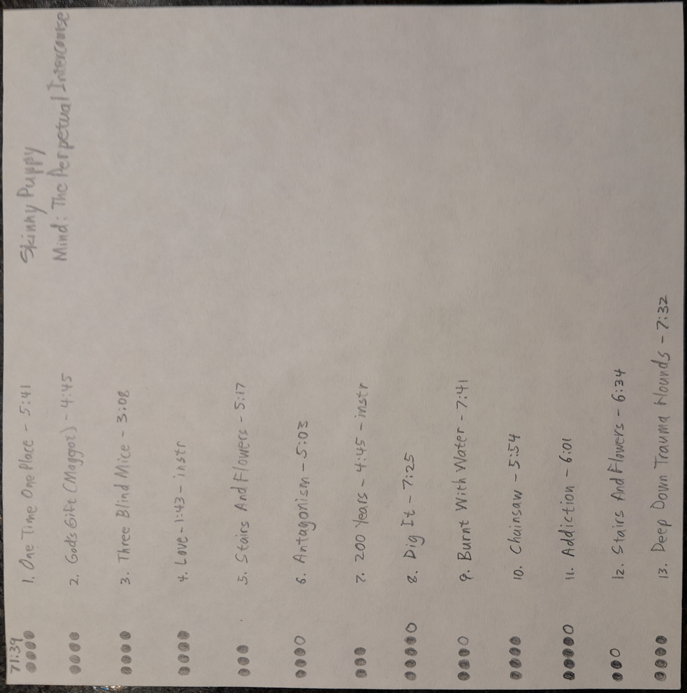

# pyrate
## Description:

### A Python project for managing music ratings in my collection.

In 1988 I started rating albums in my CD collection. For each album I would cut out a piece of paper to fit inside the booklet, and write out a track listing with times, and ratings, and occasionally additional notes for DJing.



Sometime around 1990 I started tracking my ratings in a text file in addition to the physical sheets. I have maintained this file continuously since then.

In 2007 I created an account on rateyourmusic.com with the intention of possibly migrating my ratings into that site, but for multiple reasons I have not done so. The first reason is that RYM does not calculate a personal average rating for each release; they only calculate an average rating across all member ratings on the site. Another reason is the sheer amount of time it would take to transfer all the data given my track rating file containing over 17,000 releases.

This project started as an attempt to answer some questions for myself: What albums do I rate the most highly based on the track ratings, and how well does that correspond to which album I queue up most frequently. Does my perception of what are my favorites actually match up to what I've rated the most highly?

An additional long term goals for this project is to create structured data for my collection, which can replace, or supplement my unstructured text file.

And finally, I want to create a web-scraping process to inject my rating information into my rateyourmusic account (and potentially any other music rating site) so I dont have to do it by hand.

## Structure:

### track.py

Class definition for a single track comprising a title, artist, and rating. A track title is required. Artist and rating are optional.

### album.py

Class defintion for an album comprising a list of tracks, a title, and an artist. This class provieds a method for calculating the average rating from the track list. The term album is used loosely and includes singles, EPs, compilations, etc. I considered calling this class Release for a more generic term, but since release already has meaning in the software industry, I decided that would be confusing.

In my initial implementation, this class included a method for parsing the album from my source text file, but I decided that wasn't good encapsulation, and that the parsing of a specific format did not belong in this class.

## parserat.py

Handles reading a text file containing track rating in my idiosyncratic format, and loading it into a list of Album objects. An internal State class manages transitions from one album to another.

## sortrat.py

Simple wrapper around built in python list sorting. In the long run I want to expand the kinds of sorts I can do, for example sorting albums only, excluding singles, EPs, live releases, etc. With that in mind, I decided it would be useful to encapsulate the sorting functionality.

## dumprat.py

Output the collection information. Currently this just outputs a simple text file list of rating, album, and artist. I want to add additional formats such as json.

## project.py

Wrapper aroud the uderlying code to present the functionality following the course requirements.

## Virtual Environment:
When working in Visual Studio Code on Windows it is useful to create a virtual environment

```
py -3 -m venv .venv
Set-ExecutionPolicy -ExecutionPolicy RemoteSigned -Scope Process
.venv\scripts\activate
```

## TODO:
- [x] Start project
- [ ] Track class
  - [x] Parse track from line
  - [x] Handle track with artist
  - [ ] Add track-number attribute
- [ ] Album class
  - [x] Add track
  - [x] Calculate average rating
  - [ ] Additional attributes (compilation, single, EP, etc.)
- [ ] Parse file
  - [x] Single artist single album
  - [x] Single artist multiple albums
  - [x] Various artists album
  - [x] Various artists series
  - [ ] Handle non-integer track numbering
  - [ ] Split artist collaborations
  - [ ] Handle multi-disc releases
- [x] Produce ranking list
  - [ ] Option to exclude partial ratings 
- [ ] Produce json
- [ ] Calculate median and mode
- [ ] Inject ratings into rateyourmusic.com
